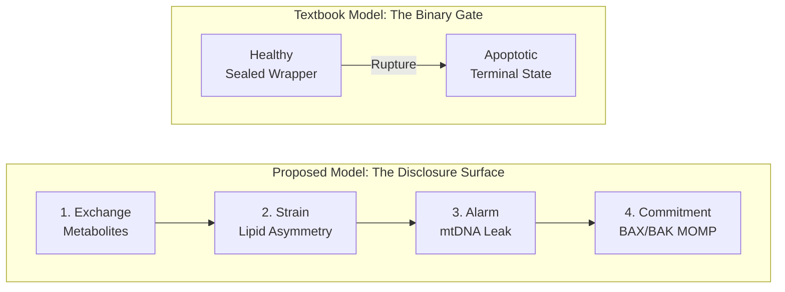
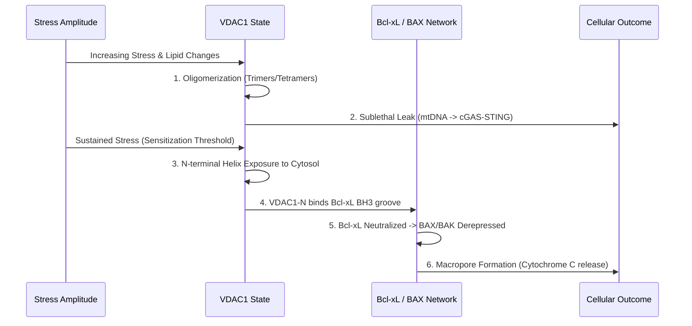

# The Mitochondrial Disclosure Surface: VDAC1, Cardiolipin, and the Sensitization Axis

**Authors:** Anthony Vasquez Sr. 
*The Temple of Two*

---

## Abstract

The outer mitochondrial membrane is traditionally viewed as a passive barrier or a binary pore during cell death. We propose a paradigm shift, framing the outer membrane as an active "disclosure surface" whose physical state vector continuously publishes mitochondrial condition to the cytosol. Central to this model is a sequential-sensitization spine where VDAC1 oligomerization functions as a single upstream axis gating downstream cellular responses. As stress escalates, progressive VDAC1 oligomerization and N-terminal helix exposure transition the membrane through distinct regimes: metabolic exchange, mitophagic containment (cardiolipin externalization), inflammatory alarm (sublethal mtDNA release), and terminal apoptosis. Crucially, we propose that sustained VDAC1 N-terminal exposure neutralizes Bcl-xL, derepressing BAX/BAK to form macropores. This provides a unified mechanistic link between inflammatory and apoptotic disclosures. To distinguish this sequential model from independent parallel-attractor models, we outline a minimal multiplexed experiment tracking VDAC1-N/Bcl-xL co-occupancy alongside mtDNA and cytochrome c release. This framework redefines VDAC1 as a central witness-node integrating local lipid, redox, and protein-partner signals.

---

## Introduction

*(Instructions for rewriting: Condense original Sections I, II, and III. Focus on the motivation for re-framing the outer mitochondrial membrane (OMM). Explain why the "binary gate" model is inadequate and introduce the concept of the OMM as a continuous publisher of internal state. Briefly introduce VDAC1 as a partner-dependent node rather than a sovereign decider.)*

The textbook model of the outer mitochondrial membrane (OMM) treats it as a semi-permeable wrapper that becomes a discrete binary gate during terminal cellular events like apoptosis. Under this paradigm, the membrane is either sealed (in health) or ruptured (in death). We argue that this framing fails to capture the continuous, graded nature of mitochondrial signaling. The OMM is more accurately modeled as an active **disclosure surface**—a physical layer whose continuously varying state vector (lipid packing, cholesterol content, partner availability) dictates what class of mitochondrial cargo is published into the cytosol, and at what bandwidth. 

In healthy states, this disclosure is low-bandwidth metabolic traffic. Under stress, the interface shifts to disclose lipid asymmetry (cardiolipin), then nucleic-acid fragments (mtDNA), and finally macromolecular pro-apoptotic cargo (cytochrome c). 

At the center of this interface is the Voltage-Dependent Anion Channel 1 (VDAC1). VDAC1 is often studied as a fixed-function channel or a specific pore. We reposition VDAC1 as a central "witness-node" whose function is entirely context-dependent, dictated by its current partner network (e.g., Hexokinase-II, Bcl-xL, lipid domains). 

**Figure 1: Paradigm Shift from Binary Gate to Disclosure Surface**

---

## Results and Discussion

*(Instructions for rewriting: Present the "v0.3 sequential-sensitization spine" from Section IV as the core mechanistic synthesis. Include the 5-state spectrum table. Follow this with the multiplexed regime-discrimination experiment from Section VII, presented as the falsification criteria for the model.)*

### The Sequential Sensitization Spine

Current models often treat the stress regimes of the OMM—mitophagic containment, inflammatory mtDNA alarm, and apoptotic commitment—as parallel attractors with distinct pore architectures (e.g., VDAC1 oligomeric pores for alarm vs. BAX/BAK macropores for commitment). 

We propose a unifying mechanism: a **sequential-sensitization spine**. In this model, VDAC1 oligomerization acts as a single upstream sensitization axis. Driven by stress-induced lipid changes (such as cardiolipin externalization and oxidation) and shifts in partner occupancy, VDAC1 oligomerization exposes its N-terminal helix at the cytosolic face. 

This exposed helix presents a binding surface that maps to the BH3-binding groove of Bcl-xL. We propose that by occupying this groove, the VDAC1-N terminus neutralizes Bcl-xL's capacity to sequester BAX and BAK. This derepresses BAX/BAK, lowering the threshold for their oligomerization into macropores. Thus, VDAC1 oligomerization is not a parallel pore competing with BAX/BAK; it is the upstream event that gates BAX/BAK activation.

**Figure 2: The Sequential-Sensitization Spine**

**Table 1: The Five-State Spectrum of Mitochondrial Disclosure**
*(Insert Table from Section IV here)*

### A Falsifiable Minimal Multiplexed Experiment

To distinguish our sequential-sensitization model from parallel-attractor models, we propose a minimal multiplexed experiment. By conducting a stress titration in a cell system dependent on VDAC1/HK-II, we predict a specific temporal ordering of molecular events. 

**Figure 3: Predicted Temporal Ordering (Titration / Timecourse)**

```mermaid
gantt
    title Predicted Temporal Ordering
    dateFormat  X
    axisFormat %s
    
    section Upstream Sensitization
    VDAC1 Oligomerization       :a1, 0, 30
    VDAC1 N-Terminal Exposure   :a2, 20, 60
    
    section Alarm Cargo
    Cytosolic mtDNA (Short)     :a3, 10, 50
    cGAS-STING Activation       :a4, 15, 60
    
    section The Threshold
    VDAC1-N / Bcl-xL Binding    :crit, a5, 30, 70
    
    section Terminal Commitment
    BAX/BAK Activation          :a6, 40, 80
    Cytochrome c / MOMP         :a7, 50, 90
```

**Predicted Temporal Order:**
1. VDAC1 oligomerization rises above baseline.
2. Short-fragment mtDNA appears in the cytosol (cGAS-STING activation).
3. VDAC1 N-terminal helix exposure crosses a critical threshold.
4. Bcl-xL occupancy shifts from BH3-only proteins to VDAC1-N.
5. BAK/BAX conformational activation.
6. Cytochrome c and full-length mtDNA release.

**Falsification Criteria:**
The sequential model would be falsified if:
- mtDNA alarm appears without detectable VDAC1 N-terminal exposure.
- VDAC1-N exposure occurs without subsequent changes in Bcl-xL/BAK occupancy.
- BAX/BAK activation reproducibly precedes VDAC1 oligomerization.

---

## Methods

*(Instructions for rewriting: Draft protocol-level descriptions based on the experiment proposed in Section VII. While this is currently a theoretical blueprint, EMBO requires structured methods. Detail how these variables would be measured in practice.)*

* **VDAC1 Oligomerization State:** Assessed via chemical crosslinking followed by native PAGE, or High-Speed Atomic Force Microscopy (HS-AFM) in isolated OMM.
* **VDAC1 N-Terminal Helix Exposure:** Measured using conformation-specific antibodies or FRET pairs.
* **Bcl-xL Occupancy (VDAC1-N vs. BH3-only proteins):** Evaluated via co-immunoprecipitation (co-IP) or Bimolecular Fluorescence Complementation (BiFC).
* **BAK/BAX Activation:** Detected using conformation-specific antibodies.
* **Cytosolic mtDNA Quantification:** Size-resolved droplet digital PCR (ddPCR) to distinguish short fragments from full-length circles following digitonin fractionation.
* **Cardiolipin Externalization/Oxidation:** Tracked using cardiolipin-binding probes (e.g., NAO-flow) and oxidative lipidomics (LC-MS).
* **cGAS-STING Activation:** Monitored via cGAMP levels, IRF3 phosphorylation (phospho-flow), and Interferon-Stimulated Gene (ISG) signature expression.

---

## Data Availability
The conceptual synthesis and full theoretical framework (v0.3) are available on Zenodo (DOI: 10.5281/zenodo.20373134) and GitHub (https://github.com/templetwo). No primary datasets were generated for this manuscript.

