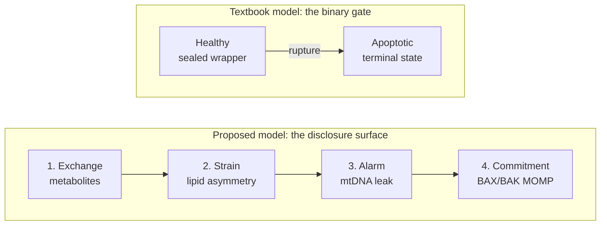
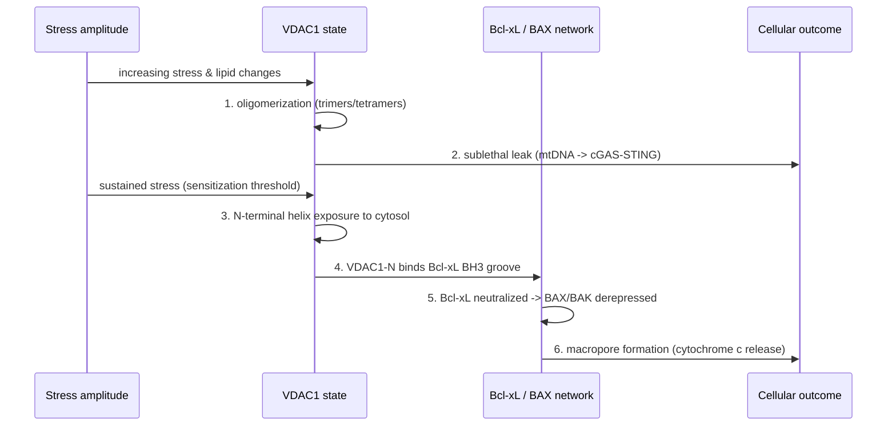

# Figure source — Exploratory Report

These are the schematic sources for Figures 1–3. They render directly on GitHub (Mermaid).
**Production note:** EMBO Reports requires figures as vector/high-resolution raster (PDF/EPS, or TIFF at ≥300 ppi). Before submission, export each diagram to a clean vector schematic (e.g., redraw in Illustrator/Inkscape or render Mermaid to SVG → PDF). The existing repository PNGs (`figures/fig1–3`) depict the broader mtDAMP→disease overview and do **not** depict the v0.3 spine — they should not be used as the submission figures without redrawing.

---

## Figure 1 — From binary gate to disclosure surface

## Figure 2 — The sequential-sensitization spine

## Figure 3 — Predicted temporal ordering (titration / timecourse)

```mermaid
gantt
    title Predicted temporal ordering
    dateFormat X
    axisFormat %s
    section Upstream sensitization
    VDAC1 oligomerization       :a1, 0, 30
    VDAC1 N-terminal exposure    :a2, 20, 60
    section Alarm cargo
    Cytosolic mtDNA (short)      :a3, 10, 50
    cGAS-STING activation        :a4, 15, 60
    section The threshold
    VDAC1-N / Bcl-xL binding     :crit, a5, 30, 70
    section Terminal commitment
    BAX/BAK activation           :a6, 40, 80
    Cytochrome c / MOMP          :a7, 50, 90
```

